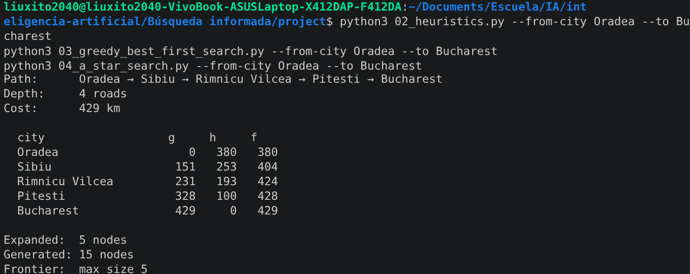
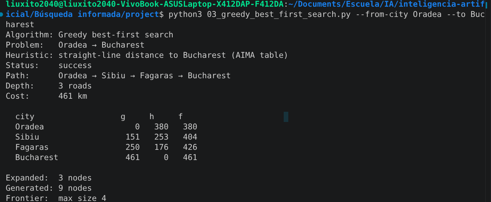
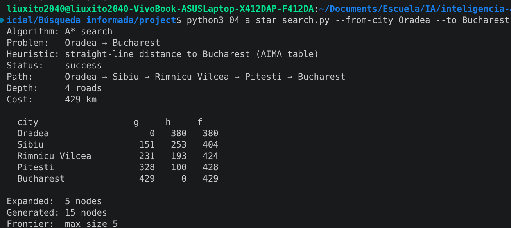

# Búsqueda informada, ejercicio 1

Elegí la pareja Oradea a Bucharest en lugar de la que viene por defecto, Arad a Bucharest. La heurística sigue siendo la distancia en línea recta hasta Bucharest, la tabla que trae el libro AIMA, así que es admisible y consistente.

## El subgrafo

```
                     Oradea (h=380)
                        |
                     151 km
                        |
                     Sibiu (h=253)
                    /              \
              99 km                80 km
                /                      \
   Fagaras (h=176)              Rimnicu Vilcea (h=193)
        |                                |
    211 km                           97 km
        |                                |
        |                        Pitesti (h=100)
        |                                |
        |                            101 km
        |                                |
        +----------> Bucharest (h=0) <---+
```

Greedy se va por la izquierda (Fagaras) y A* por la derecha (Rimnicu Vilcea, Pitesti).

## Resultados

| Algoritmo | Camino | Profundidad | Costo | Expandidos | Generados |
|---|---|---|---|---|---|
| Greedy | Oradea, Sibiu, Fagaras, Bucharest | 3 | 461 km | 3 | 9 |
| A* | Oradea, Sibiu, Rimnicu Vilcea, Pitesti, Bucharest | 4 | 429 km | 5 | 15 |
| UCS (referencia) | Oradea, Sibiu, Rimnicu Vilcea, Pitesti, Bucharest | 4 | 429 km | 10 | 27 |

A* y UCS caen en el mismo costo, 429 km, así que ese es el óptimo real. Greedy se queda con 461 km, 32 km de más.

## Por qué greedy falla aquí

Greedy solo mira h y se olvida de lo que ya gastó en el camino. Al llegar a Sibiu tiene dos vecinos candidatos, Fagaras con h de 176 y Rimnicu Vilcea con h de 193. Como 176 es más chico, agarra Fagaras, aunque esa carretera cuesta 211 km. La otra opción, pasar por Rimnicu Vilcea y Pitesti, suma 198 km en total, menos, pero greedy nunca lo compara porque no calcula g.

Con f sí se ve la diferencia. En Fagaras, f = 250 + 176 = 426. En Rimnicu Vilcea, f = 231 + 193 = 424. Son apenas 2 km de diferencia, pero eso basta para que A* tome la otra ruta y termine más barato.

## La f de A* no baja

| Ciudad | g | h | f |
|---|---|---|---|
| Oradea | 0 | 380 | 380 |
| Sibiu | 151 | 253 | 404 |
| Rimnicu Vilcea | 231 | 193 | 424 |
| Pitesti | 328 | 100 | 428 |
| Bucharest | 429 | 0 | 429 |

380, 404, 424, 428, 429. Va subiendo todo el camino, nunca baja. Eso pasa porque la heurística es consistente, cumple que h de una ciudad nunca es mayor que el tramo hasta el vecino más el h del vecino. Por eso cuando A* saca una ciudad de la frontera ya sabe que ese es su costo final, no hace falta revisarla otra vez.

## Sobre el número de nodos

Greedy expandió solo 3 nodos, va directo sin fijarse en nada más, pero por eso también se equivoca. A* expandió 5, más que greedy pero bastante menos que los 10 de UCS. La heurística ahorra trabajo sin perder el camino óptimo.

## Evidencia








