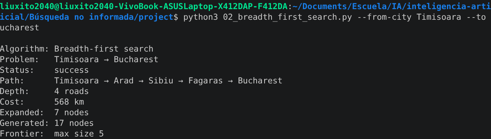
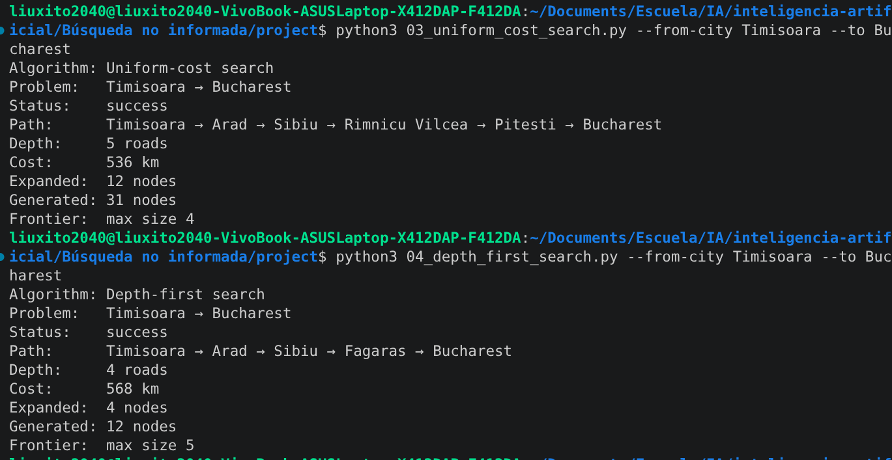
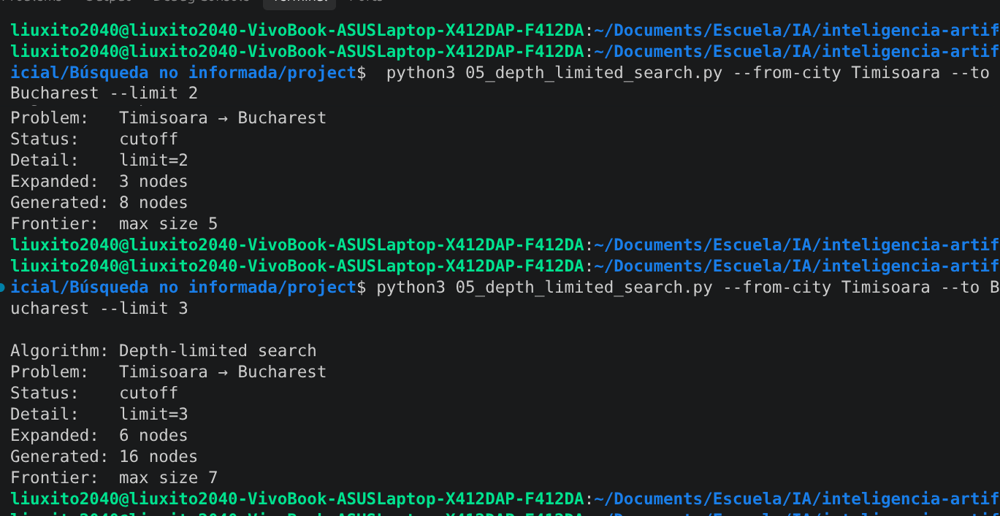
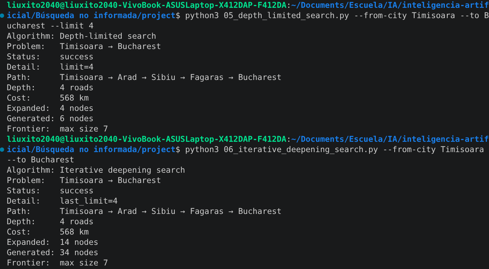

# Búsqueda no informada, ejercicio 1

Elegí la pareja **Timisoara -> Bucharest** en lugar de la que viene por defecto,
Arad -> Bucharest. Es una de las parejas sugeridas y resultó buena para el
ejercicio porque BFS y UCS discrepan con claridad.

## El subgrafo

```
Timisoara
    |
  118 km
    |
   Arad
    |
  140 km
    |
  Sibiu (h no aplica aquí, es búsqueda no informada)
   /                          \
 99 km                        80 km
 /                              \
Fagaras                   Rimnicu Vilcea
   \                              |
  211 km                       97 km
     \                            |
      \                       Pitesti
       \                          |
      101 km                  101 km
         \                        |
          +----> Bucharest <-----+
```

Camino de BFS/DFS/DLS/IDS: Timisoara -> Arad -> Sibiu -> Fagaras -> Bucharest
(por la izquierda). Camino de UCS: Timisoara -> Arad -> Sibiu -> Rimnicu Vilcea ->
Pitesti -> Bucharest (por la derecha).

## Resultados

| Algoritmo | Camino | Depth (roads) | Cost (km) | Expanded | Generated | Status |
|---|---|---|---|---|---|---|
| BFS | Timisoara, Arad, Sibiu, Fagaras, Bucharest | 4 | 568 | 7 | 17 | success |
| UCS | Timisoara, Arad, Sibiu, Rimnicu Vilcea, Pitesti, Bucharest | 5 | 536 | 12 | 31 | success |
| DFS | Timisoara, Arad, Sibiu, Fagaras, Bucharest | 4 | 568 | 4 | 12 | success |
| DLS (limit=2) | - | - | - | 3 | 8 | cutoff |
| DLS (limit=3) | - | - | - | 6 | 16 | cutoff |
| DLS (limit=4) | Timisoara, Arad, Sibiu, Fagaras, Bucharest | 4 | 568 | 4 | 6 | success |
| IDS | Timisoara, Arad, Sibiu, Fagaras, Bucharest | 4 | 568 | 14 (acumulado) | 34 (acumulado) | success |

## Reporte

### BFS vs UCS

BFS devuelve Timisoara-Arad-Sibiu-Fagaras-Bucharest, 4 carreteras, que es el
mínimo número de hops posible entre esas dos ciudades (cualquier otra ruta
pasa por al menos 5 aristas). UCS en cambio devuelve
Timisoara-Arad-Sibiu-Rimnicu Vilcea-Pitesti-Bucharest, 5 carreteras pero 536
km, más barato que los 568 km del camino de BFS.

La razón es que en Sibiu hay dos vecinos, Fagaras (99 km) y Rimnicu Vilcea
(80 km), y como los dos quedan a la misma profundidad, BFS los trata igual y
se va por orden alfabético, sin fijarse en que después de Fagaras faltan 211
km hasta Bucharest mientras que por Rimnicu Vilcea y Pitesti son 97+101. UCS
sí lleva la cuenta del costo acumulado en la frontera, por eso termina
agarrando la ruta con una carretera más pero más barata.

### Por qué DFS puede fallar aunque coincida acá

En esta corrida DFS terminó igual que BFS porque el primer vecino alfabético
en cada bifurcación resultó ser también el que lleva al camino corto. Es
coincidencia de esta pareja de ciudades, no algo que DFS garantice. DFS baja
por la primera rama que encuentra y se queda con ella hasta el fondo o hasta
un callejón sin salida, sin comparar contra otras opciones ni sumar costo. Si
el vecino alfabéticamente menor de algún nodo del camino llevara a una parte
más profunda o más cara del mapa, DFS igual devolvería esa ruta, porque solo
busca el primer camino completo, no el más corto ni el más barato.

### Límite de DLS y su relación con BFS/IDS

Con `--limit 2` y `--limit 3` DLS da `cutoff`, porque el límite es menor que
la profundidad de cualquier solución (Bucharest está a 4 carreteras como
mínimo desde Timisoara). En `--limit 4` ya encuentra la solución, la misma
Timisoara-Arad-Sibiu-Fagaras-Bucharest de BFS y con la misma profundidad. El
límite mínimo donde DLS deja de dar cutoff coincide con la profundidad del
camino óptimo en hops, que es justo lo que hace IDS por dentro: prueba 0, 1,
2, 3 y recién en 4 encuentra la solución (`last_limit=4` en la salida).

## Sobre nodos expandidos

BFS expande 7 nodos y genera 17. UCS, al tener que seguir extrayendo de la
frontera ordenada por costo hasta confirmar que no hay un camino más barato,
expande 12 y genera 31: "trabaja" más que BFS en esta instancia porque su
criterio de parada depende del costo acumulado, no de encontrar primero el
destino en la frontera. DFS es el más barato en expansiones (4) porque baja
directo por la rama correcta sin backtracking en este caso. IDS expande 14 en
total porque repite el trabajo de los niveles 0 a 3 antes de llegar al nivel
4 donde está la solución; ese es el costo extra que paga IDS a cambio de no
necesitar guardar toda la frontera en memoria como BFS.

## Evidencia








